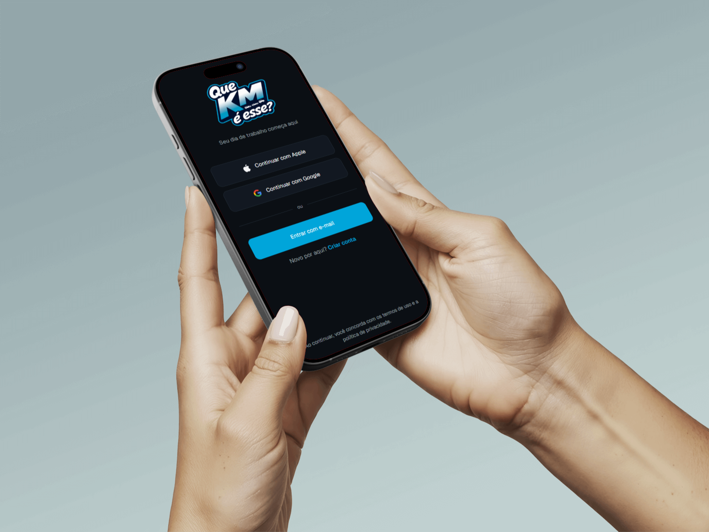
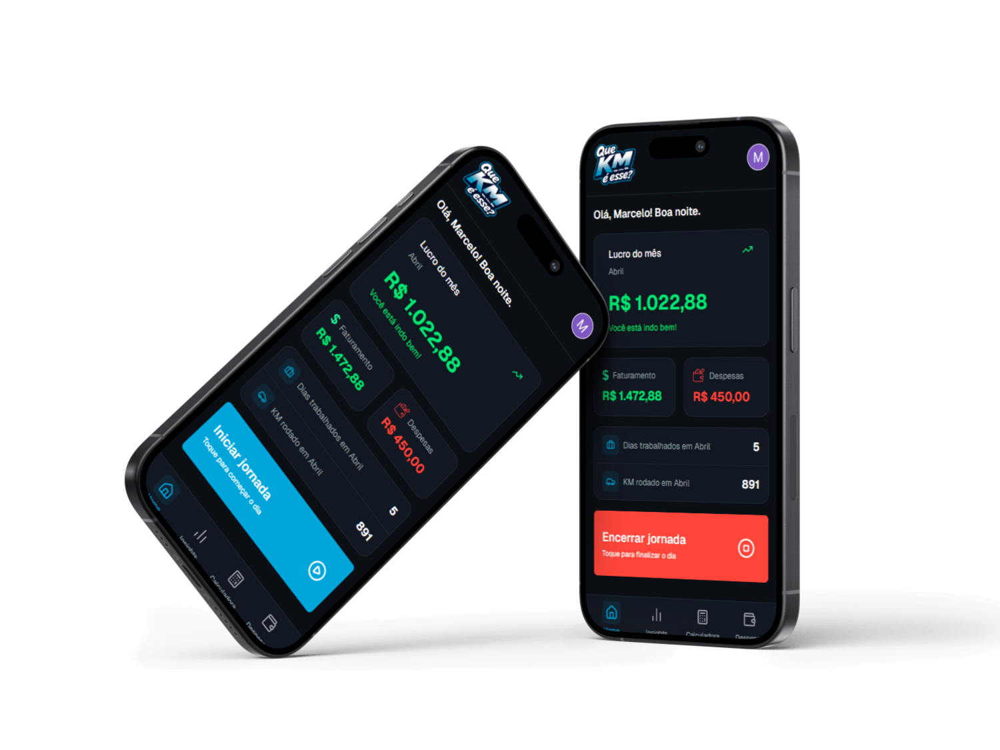
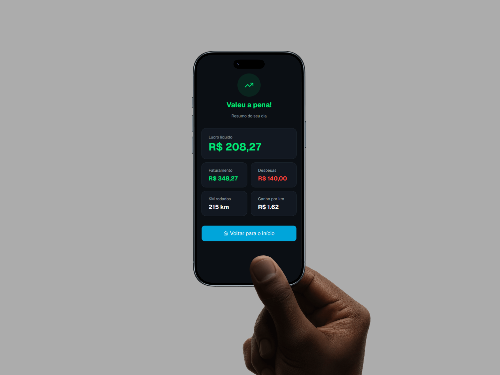
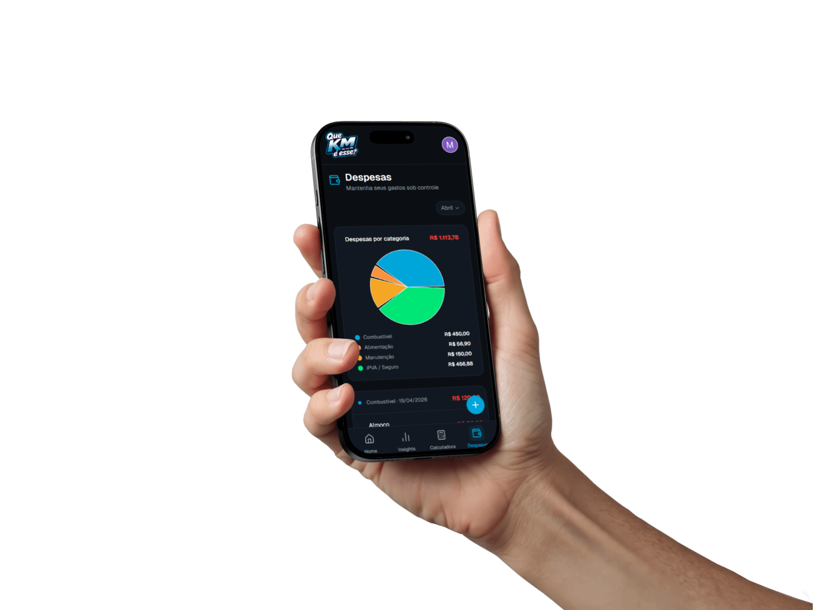
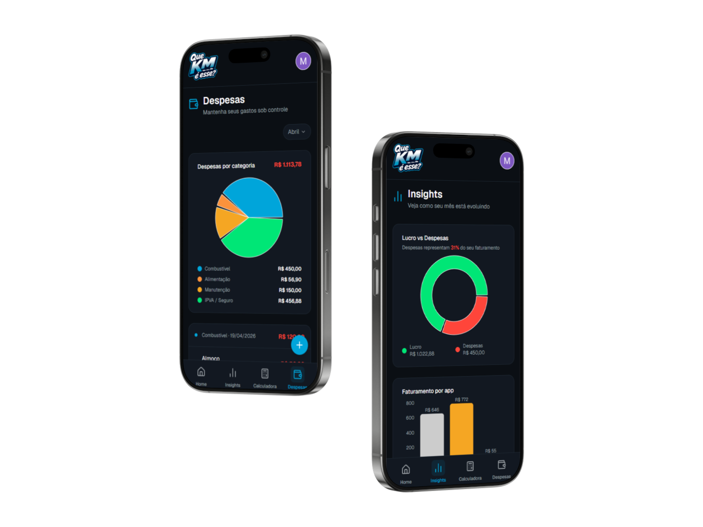
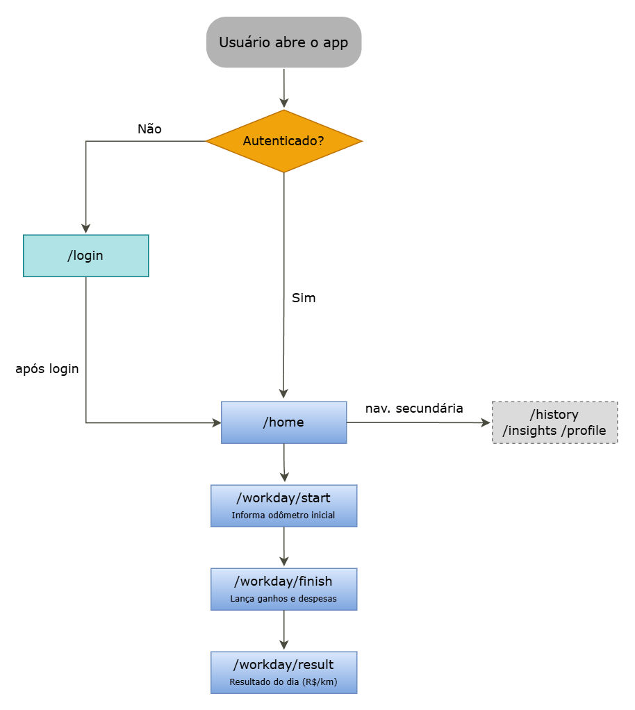

<div align="center">

# Que KM é Esse? — Frontend

App mobile-first para motoristas de aplicativo saberem, no fim do dia, se a jornada compensou.

[Abrir o App](https://que-km-web.vercel.app) · [Repositório da API](https://github.com/MarceloMendes021/que-km-api) · [Reportar Bug](https://github.com/MarceloMendes021/que-km-web/issues)


</div>

---

## O Problema

Motorista de app olha pro saldo no final do dia e acha que foi bom. Mas esse número não conta metade da história — gasolina, desgaste, manutenção, horas parado no trânsito. Tudo isso come a margem sem aparecer em lugar nenhum.

O **Que KM é Esse?** resolve isso de forma direta: registra o início e o fim da jornada, lança o que entrou e o que saiu, e entrega uma resposta objetiva sobre quanto foi ganho por quilômetro rodado.

Funciona como PWA instalável, orientação retrato, sem precisar de loja de apps.

---

## Preview

<div align="center">
  
  
</div>

<div align="center">
  
  
</div>

<div align="center">
  
</div>
---

## Diagrama de Fluxo



## Funcionalidades

- Registra odômetro no início e fim da jornada
- Lança ganhos separados por plataforma (Uber, 99, particular)
- Registra despesas por categoria e forma de pagamento
- Calcula valor ganho por KM rodado com avaliação da corrida
- Histórico de jornadas navegável por mês
- Insights financeiros mensais com gráficos
- Perfil com configuração de metas e veículo

---

## Stack

| Tecnologia            | Versão     | Uso                                          |
| --------------------- | ---------- | -------------------------------------------- |
| React                 | 19         | Base do projeto                              |
| TypeScript            | 5.9        | Tipagem em todo o código                     |
| Vite                  | 7          | Build e servidor de desenvolvimento          |
| Tailwind CSS          | v4         | Estilização                                  |
| Zustand               | 5          | Estado global da jornada ativa com persist   |
| TanStack Query        | 5          | Cache e sincronização com a API              |
| React Router DOM      | 7          | Roteamento com rotas públicas e privadas     |
| React Hook Form + Zod | 7 + 4      | Formulários com validação tipada             |
| shadcn/ui             | radix-nova | Componentes acessíveis via `@/components/ui` |
| Recharts              | 3          | Gráficos nos insights mensais                |
| Framer Motion         | 12         | Animações de transição entre telas           |
| Axios                 | 1          | Comunicação com a API                        |
| Clerk React           | 5          | Autenticação e sessão no cliente             |
| Geist                 | variável   | Fonte principal                              |

---

## Estrutura de Pastas

```
src/
├── app/
│   ├── providers/
│   │   └── AppProviders.tsx        # ClerkProvider, QueryClientProvider e demais wrappers
│   ├── router/
│   │   └── AppRouter.tsx           # Definição de todas as rotas com createBrowserRouter
│   └── ProtectedRoute.tsx          # Verifica sessão do Clerk; redireciona para /login se necessário
│
├── pages/                          # Uma página por rota da aplicação
│   ├── HomePage.tsx
│   ├── LoginPage.tsx
│   ├── RegisterPage.tsx
│   ├── OnboardingPage.tsx
│   ├── ForgotPasswordPage.tsx
│   ├── SSOCallbackPage.tsx
│   ├── WorkdayStartPage.tsx
│   ├── WorkdayFinishPage.tsx
│   ├── WorkdayResultPage.tsx
│   ├── ExpensesPage.tsx
│   ├── HistoryPage.tsx
│   ├── InsightsPage.tsx
│   ├── KmCalculatorPage.tsx
│   ├── ProfilePage.tsx
│   ├── MyJourneyPage.tsx
│   └── HelpPage.tsx
│
├── features/                       # Lógica organizada por domínio
│   ├── workday/
│   │   ├── components/
│   │   │   └── WorkdayActionButton.tsx
│   │   ├── config/
│   │   │   └── apps.ts             # Configuração das plataformas (Uber, 99, particular)
│   │   ├── stores/
│   │   │   └── useWorkdayStore.ts  # Zustand store com persist da jornada ativa
│   │   └── utils/
│   │       ├── validateOdometer.ts
│   │       └── validateWorkdayFinish.ts  # Validação e cálculo do resultado do dia
│   ├── expenses/
│   │   ├── components/
│   │   │   └── ExpenseSheet.tsx
│   │   └── utils/
│   │       └── expensesUtils.ts    # Configuração de categorias e formas de pagamento
│   ├── history/
│   │   └── utils/
│   │       └── historyUtils.ts     # calculateWorkdayMetrics
│   ├── home/
│   │   └── components/
│   │       ├── HomeStatCard.tsx
│   │       └── MonthSummaryCard.tsx
│   └── tools/
│       └── km-calculator/
│           └── utils/
│               └── calculateRideValue.ts
│
├── services/                       # Camada HTTP — todas as chamadas à API passam por aqui
│   ├── apiClient.ts                # Instância Axios com interceptor que injeta o token do Clerk
│   ├── workdayService.ts           # startWorkday, finishWorkday, getActiveWorkday
│   ├── expensesService.ts          # getExpenses, addExpense, deleteExpenses
│   ├── historyService.ts           # getWorkdayHistory com mapeamento dos campos da API
│   ├── insightsService.ts          # getMonthlyInsights
│   ├── journeyConfigService.ts     # getJourneyConfig, updateJourneyConfig
│   └── profileService.ts          # getProfile, updateProfile
│
└── shared/
    ├── components/
    │   └── DatePicker.tsx
    ├── constants/
    │   └── months.ts
    ├── hooks/
    │   └── useCurrencyInput.ts     # Formata input monetário em tempo real
    ├── layout/
    │   ├── AppHeader.tsx
    │   ├── BottomTabBar.tsx        # Barra de navegação inferior
    │   ├── PageHeader.tsx
    │   └── UserMenu.tsx
    ├── lib/
    │   ├── query-client.ts         # Configuração do TanStack QueryClient
    │   └── utils.ts                # cn() para merge de classes Tailwind
    └── utils/
        ├── formatCurrency.ts
        ├── getCurrentMonth.ts
        └── getRecentMonths.ts
```

---

## Rotas

| Rota               | Acesso  | O que é                                     |
| ------------------ | ------- | ------------------------------------------- |
| `/login`           | público | Login com e-mail ou social                  |
| `/register`        | público | Cadastro                                    |
| `/onboarding`      | público | Configuração inicial do perfil              |
| `/forgot-password` | público | Recuperação de senha                        |
| `/sso-callback`    | público | Callback do login social (Clerk)            |
| `/help`            | público | Ajuda                                       |
| `/`                | privado | Home com resumo do dia                      |
| `/workday/start`   | privado | Iniciar jornada com odômetro                |
| `/workday/finish`  | privado | Encerrar jornada e lançar ganhos e despesas |
| `/workday/result`  | privado | Resultado calculado do dia                  |
| `/expenses`        | privado | Lançar e visualizar despesas                |
| `/history`         | privado | Histórico mensal de jornadas                |
| `/insights`        | privado | Insights financeiros do mês                 |
| `/km-calculator`   | privado | Calculadora de valor por KM                 |
| `/profile`         | privado | Perfil e metas                              |
| `/my-journey`      | privado | Configuração do veículo e jornada           |

---

## Pré-requisitos

Antes de rodar o projeto, você precisa ter:

- [Node.js](https://nodejs.org) v18 ou superior
- [npm](https://npmjs.com) (já vem com o Node)
- A API (`que-km-api`) rodando localmente ou acessível via URL
- Uma conta no [Clerk](https://clerk.com) com um aplicativo criado

---

## Configuração

**1. Clone o repositório**

```bash
git clone https://github.com/MarceloMendes021/que-km-web.git
cd que-km-web
```

**2. Instale as dependências**

```bash
npm install
```

**3. Configure as variáveis de ambiente**

Crie um arquivo `.env` na raiz do projeto:

```bash
cp .env.example .env
```

Abra o `.env` e preencha:

```env
# Chave pública do Clerk — pode ser exposta no client
# Onde encontrar: dashboard.clerk.com > seu app > API Keys > Publishable key
VITE_CLERK_PUBLISHABLE_KEY=pk_live_...

# URL base da API backend
# Em desenvolvimento, aponta para o servidor local
# Em produção, use a URL do Render
VITE_API_URL=http://localhost:3000
```

---

## Rodando o Projeto

Com as dependências instaladas e o `.env` configurado:

```bash
npm run dev
```

O app abre em `http://localhost:5173`.

Para funcionar completamente, a API precisa estar rodando em paralelo. Veja as instruções no repositório [que-km-api](https://github.com/MarceloMendes021/que-km-api).

**Outros scripts:**

```bash
npm run build     # Build de produção (tsc + vite build)
npm run preview   # Visualiza a build localmente antes do deploy
npm run lint      # Roda o ESLint
```

---

## Como Funciona a Autenticação

O `apiClient.ts` intercepta toda requisição antes de enviá-la e busca o token da sessão via `window.Clerk.session.getToken()`. O token é enviado no header `Authorization: Bearer <token>`. Se a API retornar 401, o interceptor redireciona para `/login` automaticamente.

Rotas privadas são protegidas pelo `ProtectedRoute`. Ele usa `useAuth()` do Clerk e, se `isSignedIn` for falso após o carregamento, redireciona para `/login`.

```
Usuário acessa rota privada
        |
ProtectedRoute verifica isSignedIn (Clerk)
        |
Componente renderiza e chama o service
        |
apiClient injeta Bearer token no header
        |
API valida o token e retorna os dados
```

---

## Decisões Técnicas

**Zustand com persist**
A jornada ativa fica salva no localStorage enquanto está em andamento. O motorista pode fechar o app e retomar sem perder nada. O estado é limpo ao encerrar a jornada.

**TanStack Query**
Cada chamada à API tem cache automático. Ao registrar uma despesa, a query de listagem é invalidada e os dados atualizam sozinhos sem nenhum estado manual de loading ou refresh.

**Serviços isolados em `src/services/`**
Todas as chamadas HTTP ficam em um único lugar. Se a URL de um endpoint mudar, muda em um arquivo só. As páginas e features não conhecem o Axios, só chamam funções tipadas.

**Validação antes da requisição**
`validateOdometer.ts` e `validateWorkdayFinish.ts` validam os dados no client antes de qualquer chamada à API. Se o dado for inválido, o erro aparece na tela sem consumir a rede.

---

## Autor

Feito por **Marcelo Mendes**

[](https://github.com/MarceloMendes021)
[](https://www.linkedin.com/in/marcelo021)
